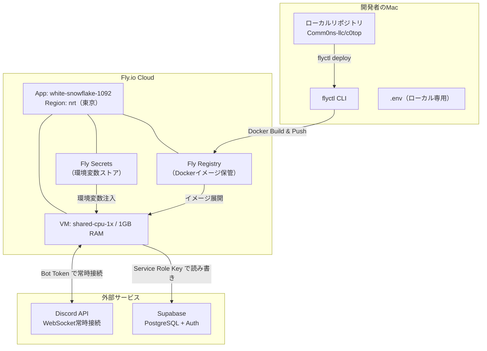
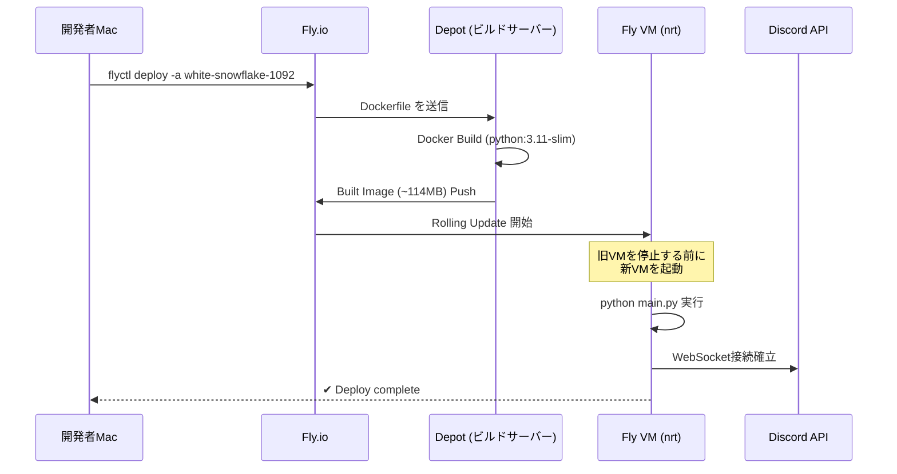
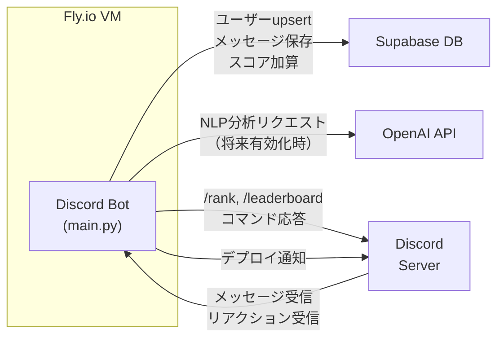

# Fly.io デプロイ & インフラ構成ガイド

Comm0ns Discord Bot の Fly.io デプロイに関する構成・手順・運用方法をまとめたドキュメントです。

---

## Fly.io と関連サービスの構成



---

## デプロイの仕組み

### デプロイで何が起きるか

`flyctl deploy` を実行すると、以下のパイプラインが自動的に走ります：



### コマンド

```bash
# 本番デプロイ（これだけでOK）
flyctl deploy -a white-snowflake-1092
```

> [!IMPORTANT]
> Git commit/push は **不要** です。`flyctl deploy` はローカルのワーキングディレクトリの現在の状態をそのままビルド・デプロイします。ただし、変更履歴管理のため `git commit && git push` を先に行うことを推奨します。

---

## 関連ファイルの役割

### fly.toml — Fly.io アプリ設定

```toml
app = 'white-snowflake-1092'     # Fly.io上のアプリ名
primary_region = 'nrt'            # 東京リージョン

[build]
  dockerfile = 'Dockerfile'       # ビルドに使うDockerfile

[[vm]]
  memory = '1gb'                  # メモリ割り当て
  cpu_kind = 'shared'             # 共有CPU
  cpus = 1                        # 1 vCPU
  memory_mb = 1024
```

### Dockerfile — コンテナイメージ定義

```dockerfile
FROM python:3.11-slim              # ベースイメージ
ENV PYTHONUNBUFFERED=1             # ログ即時出力

RUN apt-get update && apt-get install -y git && rm -rf /var/lib/apt/lists/*

WORKDIR /app
COPY requirements.txt .
RUN pip install --no-cache-dir -r requirements.txt
COPY . .
RUN mkdir -p logs

CMD ["python", "main.py"]          # Bot 起動コマンド
```

> [!NOTE]
> `.dockerignore` で `.env`、`__pycache__`、`fly.toml`、`data_export/`、ビルド成果物などはイメージから除外されます。**ローカルの `.env` はデプロイに含まれません**。

### docker-compose.yml — ローカル実行用

```yaml
services:
  bot:
    build: .
    restart: always
    env_file:
      - .env              # ローカルの.envから環境変数を読み込み
    volumes:
      - ./logs:/app/logs
```

ローカルでBotを動かしたい場合は `docker compose up` で起動できます。本番では使いません。

---

## Fly Secrets（環境変数）管理

Fly.ioでは `.env` ファイルの代わりに **Secrets** で環境変数を管理します。Secretsはイメージに含まれず、実行時にVMへ安全に注入されます。

### 現在設定されているSecrets

| Secret名 | 用途 | 補足 |
|---|---|---|
| `DISCORD_BOT_TOKEN` | BotのDiscord認証トークン | [Discord Developer Portal](https://discord.com/developers) で取得 |
| `DISCORD_GUILD_ID` | 監視対象サーバーのID | — |
| `DISCORD_NOTIFICATION_CHANNEL_ID` | デプロイ通知を送るチャンネルID | — |
| `SUPABASE_URL` | Supabase プロジェクトURL | `https://xxx.supabase.co` |
| `SUPABASE_KEY` | Service Role Key（全権限） | ⚠️ Anon Keyではなく**Service Role Key** |
| `STORAGE_BACKEND` | ストレージ種別 | `supabase` 固定 |
| `PYTHONUNBUFFERED` | ログ出力の即時反映 | `1` 固定 |

### Secrets 操作コマンド

```bash
# 一覧確認（値は表示されない）
flyctl secrets list -a white-snowflake-1092

# 追加・更新
flyctl secrets set DISCORD_BOT_TOKEN=新しいトークン -a white-snowflake-1092

# 複数同時設定（再起動は1回だけ）
flyctl secrets set KEY1=val1 KEY2=val2 -a white-snowflake-1092

# 削除
flyctl secrets unset KEY_NAME -a white-snowflake-1092
```

> [!CAUTION]
> `flyctl secrets set` を実行すると、**VMが自動的に再起動**されます。複数のSecretを変更する場合は、1コマンドでまとめて設定してください。

---

## ローカルの .env と Fly Secrets の対応

| .env のキー | Fly Secret | 備考 |
|---|---|---|
| `DISCORD_BOT_TOKEN` | ✅ 設定済み | — |
| `DISCORD_APPLICATION_ID` | ❌ 未設定 | Bot側で未使用のため不要 |
| `DISCORD_GUILD_ID` | ✅ 設定済み | — |
| `DISCORD_NOTIFICATION_CHANNEL_ID` | ✅ 設定済み | — |
| `SUPABASE_URL` | ✅ 設定済み | — |
| `SUPABASE_KEY` | ✅ 設定済み | Service Role Key |
| `SUPABASE_AUTH_KEY` | ❌ 未設定 | c0top CLI専用。Botでは不要 |
| `OPENAI_API_KEY` | ❌ 未設定 | NLP分析を有効にする場合のみ追加 |
| `OPENAI_MODEL` | ❌ 未設定 | 同上 |
| `STORAGE_BACKEND` | ✅ 設定済み | `supabase` |
| `DEBUG_MODE` | ❌ 未設定 | デフォルト `false` |

> [!TIP]
> 将来 NLP 分析を本番で有効にしたい場合は、以下のコマンドで追加してください：
> ```bash
> flyctl secrets set OPENAI_API_KEY=sk-xxx OPENAI_MODEL=gpt-4o-mini -a white-snowflake-1092
> ```

---

## 運用コマンド一覧

```bash
# ===== デプロイ =====
flyctl deploy -a white-snowflake-1092        # 本番デプロイ

# ===== 監視 =====
flyctl logs -a white-snowflake-1092           # リアルタイムログ
flyctl status -a white-snowflake-1092         # アプリ状態確認
flyctl ssh console -a white-snowflake-1092    # VMにSSH接続

# ===== マシン管理 =====
flyctl machine list -a white-snowflake-1092   # VM一覧
flyctl machine restart MACHINE_ID             # 個別VM再起動
flyctl scale count 1 -a white-snowflake-1092  # VM台数変更

# ===== Secrets（環境変数） =====
flyctl secrets list -a white-snowflake-1092   # 一覧
flyctl secrets set KEY=val -a white-snowflake-1092   # 追加/更新
flyctl secrets unset KEY -a white-snowflake-1092     # 削除
```

---

## トラブルシューティング

| 症状 | 確認コマンド | 原因 & 対処 |
|---|---|---|
| デプロイ失敗 | `flyctl logs` | Docker Buildのエラーログを確認。依存パッケージの追加漏れが多い |
| Bot起動しない | `flyctl status` | `flyctl secrets list` でSecret未設定がないか確認 |
| Botがすぐ落ちる | `flyctl logs` | `DISCORD_BOT_TOKEN` の失効→再生成して `secrets set` |
| ログが出ない | — | `PYTHONUNBUFFERED=1` がSecretに設定されているか確認 |
| デプロイ通知が来ない | `flyctl logs` | `DISCORD_NOTIFICATION_CHANNEL_ID` の値を確認 |
| DBに接続できない | `flyctl logs` | `SUPABASE_URL` / `SUPABASE_KEY` の値を確認 |

---

## 2026-03 運用で得た知見（実運用トラブル集）

### 1) `flyctl deploy` が `unauthorized` になるとき

`whoami` のアカウントが、対象 app を持っている Org と一致していないケースが最も多いです。  
今回も `tsukuru501@gmail.com` では app が見えず、実運用アカウントは `dev@comm0ns.com` でした。

```bash
flyctl auth whoami
flyctl orgs list
flyctl apps list | grep 'white-snowflake-1092' || true
```

- `apps list` に app が出ない = 権限なし（別アカウント / 別Org）
- 対処: 正しいアカウントで `flyctl auth login` し直す

> [!TIP]
> コマンドを途中改行すると `zsh: command not found: 1092` のような誤動作が起きるため、1行で実行する。

### 2) Supabase のキーは用途を分離する

RLS有効時、Botが `anon` キーで接続すると `INSERT/UPSERT` が失敗します。  
Bot と TUI で以下のように分離すること。

| 用途 | 推奨キー | 環境変数 |
|---|---|---|
| Fly上のDiscord Bot（書き込みあり） | `service_role` | `SUPABASE_KEY` |
| TUI OAuth / 読み取り系 | `anon` | `SUPABASE_AUTH_KEY`（または `SUPABASE_ANON_KEY`） |

今回実際に発生したエラー:
- `new row violates row-level security policy for table "channels"`

対処コマンド（Fly）:

```bash
flyctl secrets set -a white-snowflake-1092 \
  SUPABASE_URL='https://<project-ref>.supabase.co' \
  SUPABASE_KEY='<service_role_key>' \
  SUPABASE_AUTH_KEY='<anon_key>'
flyctl deploy -a white-snowflake-1092
```

### 3) 「反映されたか分からない」を防ぐ確認手順

```bash
flyctl status -a white-snowflake-1092
flyctl logs -a white-snowflake-1092
```

週次重複通知修正の確認ポイント:
- 同一週に通知が1回だけ
- 必要に応じて `Weekly reset already finalized ... Skip notification.` ログが見える

### 4) デプロイ完了通知（1回だけ送る仕組み）

Botは起動時にリリースIDを計算し、`bot_metadata.last_deploy_notice_version` を比較して、
新しいバージョンのときだけ通知を送ります（同一バージョン再起動では再送しない）。

確認ログ:

```bash
flyctl logs -a white-snowflake-1092 | grep -F "Sent deploy update notice"
```

失敗時の確認:

```bash
flyctl logs -a white-snowflake-1092 | grep -E "deploy update notice|Failed to send deploy update notice|Notification channel"
```

### 5) 既存 app に入れない場合の最終手段

元 app の権限が回収できない場合は、新規 app を作って移行する。  
その後 Discord Bot Token を再発行して旧環境を停止させると、二重起動を確実に防げる。

---

## データフロー概要



| イベント | Botの処理 | DB操作 |
|---|---|---|
| メッセージ送信 | スコア+3pt、NLP分析 | `users` upsert, `messages` insert |
| リアクション追加 | 投稿者に+1pt | `reactions` insert, `users` score update |
| `/rank` コマンド | 個人スコア表示 | `users` + `messages` select |
| `/leaderboard` | 上位10名表示 | `users` select (order by score) |
| 週間リセット | 月曜0:00 UTC | `users.weekly_score` を全員0にリセット |
